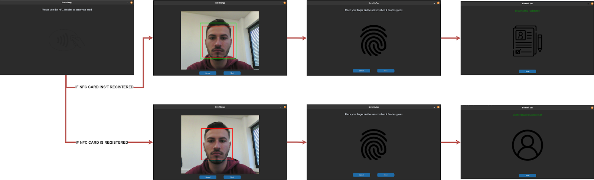
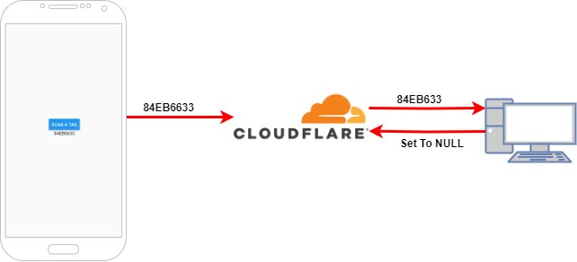
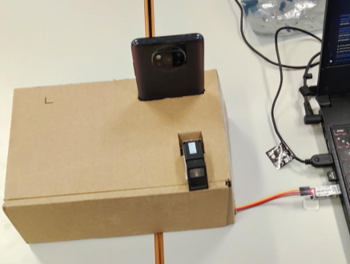
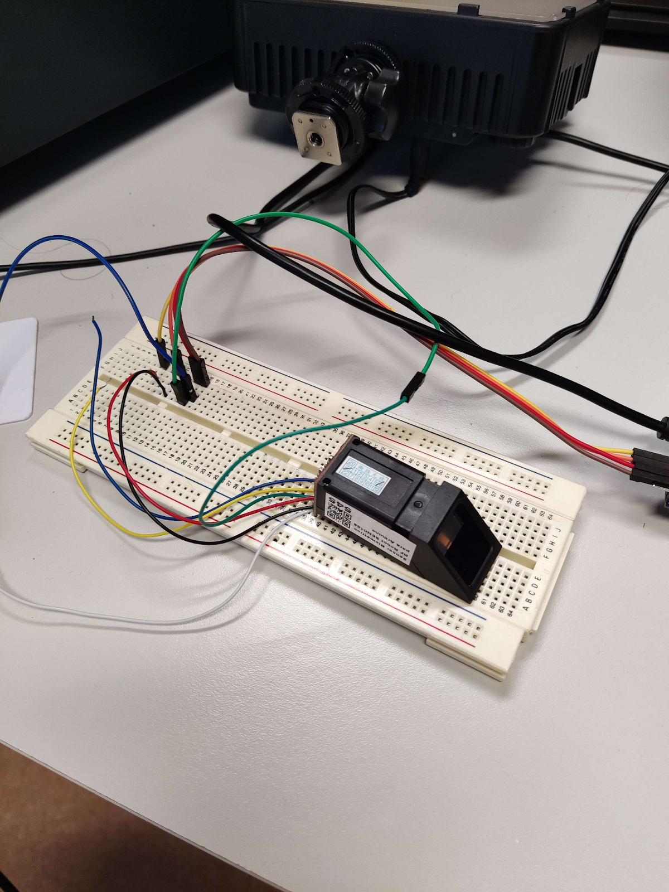
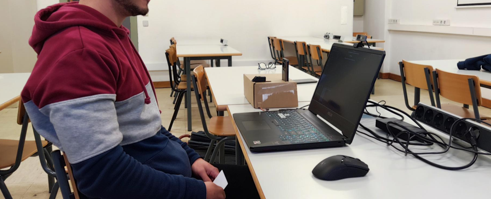

# Biometria_Projeto

This repository contains the final project for the Biometrics course, focused on building a multi-factor biometric authentication system that combines NFC, face recognition, and fingerprint recognition.

The system enhances security by requiring multiple authentication steps, while also ensuring usability through a clear UI and robust biometric algorithms.

## Project Overview

Authentication is performed in three stages:

1. NFC Card Scan – Users scan their ID card using an NFC-enabled Android app.
2. Face Recognition with Liveness Detection – Users must pass a blink-based liveness test before face matching via the DeepFace library.
3. Fingerprint Recognition – Users authenticate with a DF Robot SEN0188 sensor connected via UART-USB, using the Adafruit Fingerprint library.

If a new user is detected, the system automatically registers their credentials (face image + fingerprint model index).

✅ False Acceptance Rate (FAR): 0%

✅ False Rejection Rate (FRR): 0%

✅ Tested under different lighting, distances, and finger positions.

## System Architecture

- UI Scheme: Guides the user through the authentication pipeline.
- NFC Module: Developed in React Native (Expo Go) using react-native-nfc-manager
. Data is relayed via a Cloudflare Worker to the PC app.
- Face Recognition: Uses DeepFace (ArcFace model) for authentication. Includes a blink-based liveness test to prevent spoofing.
- Fingerprint Recognition: Uses the Adafruit Fingerprint library (v2.2.14) for communication with the DF Robot SEN0188 sensor. Fingerprint templates are stored in sensor memory and indexed in the local database.

## System Setup

NFC reader (smartphone) and Fingerprint reader

Fingerprint reader setup

Final setup with NFC reader, Fingerprint reader and PC camera

## Requirements

- Python 3.8+
- Libraries:

        pip install -r requirements.txt

- Hardware:

    - DF Robot SEN0188 (or any sensor compatible with Adafruit library)
    - UART to USB converter (MakerLab provided)
    - NFC-enabled Android phone with our React Native app installed
    - Camera for facial recognition

## How to Run
1. Clone the repository

        git clone https://github.com/NMPC27/Biometria_Projeto.git
        cd Biometria_Projeto

2. Install dependencies

        pip install -r requirements.txt

3. Run the authentication system

        python3 main.py

## User Testing

- Face Recognition:

    - Tested under varying light conditions (120–240 lux) and distances (30–100 cm).
    - Robust against spoofing attempts using photos.

- Fingerprint Recognition:

    - Tested across different finger angles (0°, 45°, 90°).
    - Consistently accurate with multiple users.

## Solved Challenges

- NFC library debugging required recompiling due to Expo limitations.

- Fingerprint hardware setup needed wiring, soldering, and troubleshooting with a multimeter.

- Adapted the Adafruit library for DF Robot sensors (original library was Arduino-only).

- Face detection initially struggled with lighting → solved by model change (removed gamma correction).

## Authors

Nuno Cunha

Bernardo Kaluza

Alexandre Gago
